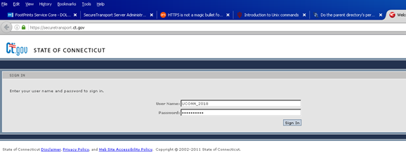

## User Upload of Data Files to SRR
External users of the SRR program can submit files via HTTPS upload utilizing their account credentials from a Web browsing session.

To access the CT.GOV Secure Transport SIGN IN page, open a Web browser (Mozilla, IE 11, Edge, Safari or Chrome are all compatible with Secure Transport) and navigate to:

https://sft.ct.gov/

 

From the SIGN IN Page, user enters their account name and password and clicks "Sign In"

**Please note that BOTH "User Name" and "Password" values are CaSE sEnSiTIVe.**

Because we had set the "Require user to change password on next login" when the account was created, the User will be prompted to change their password upon their first login.

- [x]	Carefully enter the current password and enter and then re-enter a new password for the account.

&nbsp;&nbsp;&nbsp;&nbsp;&nbsp;&nbsp;&nbsp;&nbsp;***Passwords must be at least 7 characters in length and contain at least 1 Alpha and 1 Numeric character.***

- [x]	Click "Save".

- [x]	Re-enter your account name and enter your newly created password and click "Sign In".

Upon successful authentication, the user is brought to their "home" folder.  From this screen, users can:

- [x] ***Change Password***  
&nbsp;&nbsp;&nbsp;&nbsp;&nbsp;&nbsp;&nbsp;&nbsp;&nbsp;&nbsp;***The change password screen is identical to the screen encountered when prompted to change password upon first login.***  
- [x] ***Browse*** their local system to ***Upload*** a file  
&nbsp;&nbsp;&nbsp;&nbsp;&nbsp;&nbsp;&nbsp;&nbsp;&nbsp;&nbsp;***See following example***  
- [x] ***Download*** a file from their "home" folder to their local system  
&nbsp;&nbsp;&nbsp;&nbsp;&nbsp;&nbsp;&nbsp;&nbsp;&nbsp;&nbsp;***See following example***  
- [x] Select a file to ***View (HTML)*** or ***View (Text)***  
&nbsp;&nbsp;&nbsp;&nbsp;&nbsp;&nbsp;&nbsp;&nbsp;&nbsp;&nbsp;***See following example***  
- [x] ***Delete*** a file from their "home" folder  
&nbsp;&nbsp;&nbsp;&nbsp;&nbsp;&nbsp;&nbsp;&nbsp;&nbsp;&nbsp;***See following example***  
- [x] Select a ***Transfer mode***  
&nbsp;&nbsp;&nbsp;&nbsp;&nbsp;&nbsp;&nbsp;&nbsp;&nbsp;&nbsp;***For client uploads, the default Transfer mode is "Binary" (as opposed to "ASCII"). Binary mode is distinct from ASCII mode***  
&nbsp;&nbsp;&nbsp;&nbsp;&nbsp;&nbsp;&nbsp;&nbsp;&nbsp;&nbsp;***in that it is an exact byte for byte transfer, whereas ASCII will read the data in the file and interpret the data and control***  
&nbsp;&nbsp;&nbsp;&nbsp;&nbsp;&nbsp;&nbsp;&nbsp;&nbsp;&nbsp;***characters to optimize the view of the data on the remote system.***  
- [x] Click on the ***Folder*** icon to select a folder (if user has been subscribed to multiple folders)

**Example of file browse, upload, view, and deletion**

- [x] Click "Browse" to open a file explorer window and browse your local system.  
- [x]	Click to highlight the file and select "Open" (or double-click the file).  
- [x]	You may also highlight and select multiple files to upload.  

The file name appears next the the "Browse" button, indicating that the file is in focus to be uploaded.  If you selected multiple files to upload, you will see *"x files", x* indicating the total number of files you have selected.  You can click "Upload File" to upload the file from your local system to your home folder in the Secure Transport environment.

**Example of a successful file upload for an SRR account.**

- [x]	By clicking the check box next to the file, you can then select to "Delete" the file or view the file as either "Text" or "HTML".  
- [x]	Selecting to "view" the file will open the file contents in a browser window:

- [x]	To return to your "Home" folder, hit the "back" button on your browser.

&nbsp;&nbsp;&nbsp;&nbsp;&nbsp;&nbsp;&nbsp;&nbsp;&nbsp;***DO NOT close the tab or browser window as this will terminate your Secure Transport Session abnormally.***  
&nbsp;&nbsp;&nbsp;&nbsp;&nbsp;&nbsp;&nbsp;&nbsp;&nbsp;***Terminating your browser session without using the Sign Out method in Secure Transport will void***  
&nbsp;&nbsp;&nbsp;&nbsp;&nbsp;&nbsp;&nbsp;&nbsp;&nbsp;***your session cookie, requiring you to completely close your web browser, re-launch the browser***  
&nbsp;&nbsp;&nbsp;&nbsp;&nbsp;&nbsp;&nbsp;&nbsp;&nbsp;***and re-authenticate to Secure Transport.***

To download a file from your home directory, select the file you wish to perform the action on by enabling the check mark next to the file and click "Download".  Depending upon your browser you may be prompted to View the file or Save the file to your local system.  Again, depending upon your browser, your file may be saved by default to a "download" directory in your user profile on your local system.  

&nbsp;&nbsp;&nbsp;&nbsp;&nbsp;&nbsp;&nbsp;&nbsp;&nbsp;***It is recommended that users are fully familiar with the "download" process for their particular browser and cognizant ***  
&nbsp;&nbsp;&nbsp;&nbsp;&nbsp;&nbsp;&nbsp;&nbsp;&nbsp;***of the location on their local system where browser downloads are stored.***

To delete a file from your home directory, select the file you wish to perform the action on by enabling the check mark next to the file and click "Delete".

&nbsp;&nbsp;&nbsp;&nbsp;&nbsp;&nbsp;&nbsp;&nbsp;&nbsp;***Please note that the Delete method is immediate, and does not prompt you to confirm deletion.Please use the file***  
&nbsp;&nbsp;&nbsp;&nbsp;&nbsp;&nbsp;&nbsp;&nbsp;&nbsp;***'delete' method carefully.  You may only select and delete 1 file at a time.***

&nbsp;&nbsp;&nbsp;&nbsp;&nbsp;&nbsp;&nbsp;&nbsp;&nbsp;***Also note that by default, files uploaded to your home target directory are automatically purged from the Secure***  
&nbsp;&nbsp;&nbsp;&nbsp;&nbsp;&nbsp;&nbsp;&nbsp;&nbsp;***Transport system after 60 days.***

### SRR Quick Reference

| | |
| --- | ----------- |
| Business Program owner(s) | 200 Folly Brook Boulevard, Wethersfield, CT 06109 Phone: 860-263-6281 Andrew Condon June 29, 2022
| Delegated Administrators: | |
| **Production Environment** | *Secure Transport 5.3.0*  |
| Administration: | https://159.247.3.180:444/coreadmin/auth/login.jspx |
| User Upload target: | https://SecureTransport.ct.gov |
| **Staging Environment** | *Secure Transport 5.3.0* |
| Administration: | https://159.247.3.179:444/coreadmin/auth/login.jspx |
| User Upload target: | https://SecureTransport.ct.gov |
| **Support & Incident Escalation** | *Secure Transport 5.3.0* |
| DOL Service Desk: | https://dol-ap0141/MRcgi/MRentrancePage.pl |
| DOL Contacts: | Jackie Russo |
| BITS Service Desk: | |
| BITS Contacts: |  |
| **Additional Resources** | |
| AXWAY On-Line Help: | https://159.247.3.180:444/help/Default.htm |

